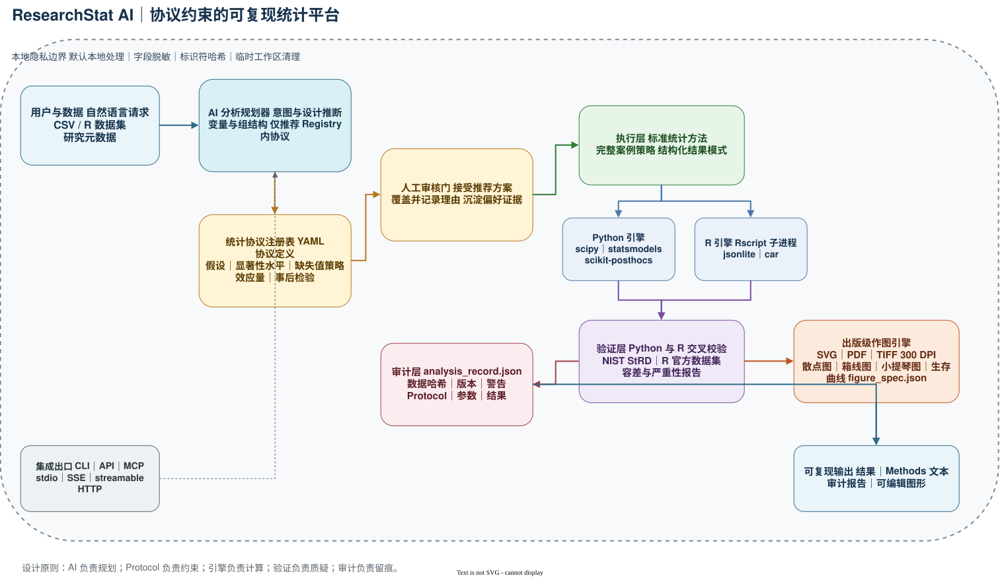
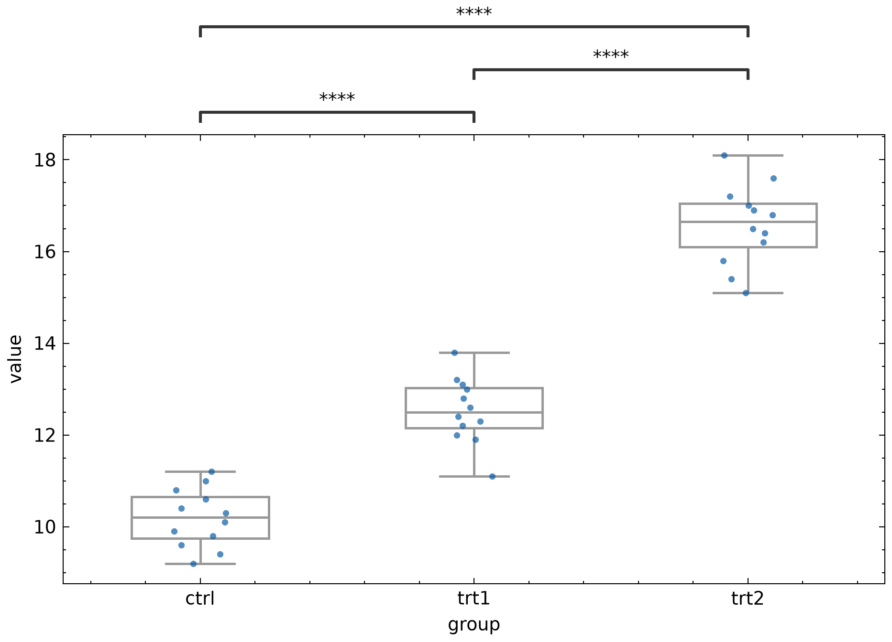
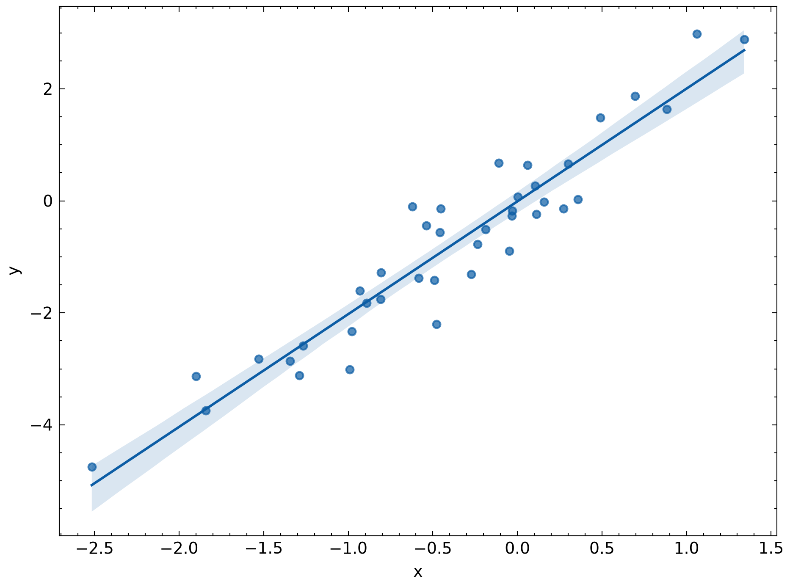

# ResearchStat AI

面向科研场景的 AI 原生统计分析与可复现性平台。它把自然语言分析请求转化为一条受 Protocol 约束、经人工评审、由 Python/R 双引擎交叉验证、并完整留痕的统计工作流。

[](https://github.com/flupke91/ResearchStat-AI/actions/workflows/ci.yml)
[](https://github.com/flupke91/ResearchStat-AI/releases)
[](LICENSE)
[](https://www.python.org/)

[English](docs/README.en.md) | [简体中文](docs/README.zh-CN.md) | [日本語](docs/README.ja.md)

## Architecture



[Open the editable draw.io source](docs/architecture/ResearchStat-AI-architecture.drawio)

## 项目简介

ResearchStat AI 的目标不是复制 GraphPad Prism、SPSS 或 Origin，而是建立一套科研级统计基础设施：所有方法都有明确 Protocol，所有结果都绑定审计记录，所有图形都可复现。

V1 已形成完整闭环：

```text
AI 规划
  -> Protocol 绑定
  -> 人工 Review
  -> Python/R 双引擎
  -> 交叉验证
  -> Audit Trail
  -> 出版级 Figure
```

核心原则：

- 统计可信度优先于功能数量。
- 所有分析必须可复现。
- 所有统计结果必须绑定明确 Protocol。
- AI 只负责规划，不负责数值计算。
- 不逆向工程商业软件。

## 实战成果

下面的图由正式 Figure Engine 直接生成，使用真实分析结果绑定 `analysis_id` 和 Protocol。

### 单因素 ANOVA + Tukey 的 boxplot

输入：“compare three drugs on mouse tumor size”。

推荐并执行的协议：`one_way_anova_tukey_v1`。

实际结果：

| 统计量 | 值 |
| - | - |
| F | 223.92 |
| df1 / df2 | 2 / 33 |
| p | 6.35e-20 |
| eta_squared | 0.931 |



输出文件：

- SVG：[boxplot_figure.svg](docs/images/boxplot/boxplot_figure.svg)
- PDF：[boxplot_figure.pdf](docs/images/boxplot/boxplot_figure.pdf)
- TIFF：[boxplot_figure.tiff](docs/images/boxplot/boxplot_figure.tiff)
- 图表规格：[boxplot_figure_spec.json](docs/images/boxplot/boxplot_figure_spec.json)

### 回归 scatter



输出文件：

- SVG：[scatter_figure.svg](docs/images/scatter/scatter_figure.svg)
- PDF：[scatter_figure.pdf](docs/images/scatter/scatter_figure.pdf)
- TIFF：[scatter_figure.tiff](docs/images/scatter/scatter_figure.tiff)

### Audit Trail 示例

每次分析生成 `analysis_record.json`：

```json
{
  "analysis_id": "d7b939710e2c4d29938090d2de8df154",
  "user_input": "compare three drugs on mouse tumor size",
  "protocol_id": "one_way_anova_tukey_v1",
  "dataset_hash": "6a833b74cf008278...",
  "human_review": {
    "action": "accept",
    "final_protocol_id": "one_way_anova_tukey_v1"
  },
  "results": {
    "statistics": {
      "F": 223.91748907214628,
      "df1": 2,
      "df2": 33
    },
    "p_values": {
      "overall": 6.34665861154214e-20
    },
    "effect_size": {
      "eta_squared": 0.9313693855481177
    }
  }
}
```

## 核心模块

- Protocol Registry：YAML 定义方法、假设、posthoc、alpha、缺失值策略和效应量，V1 内置 11 个协议。
- AI Planner：自然语言转结构化计划，只能从 Registry 选择协议。
- Human Review：分析前接受或覆盖推荐协议，记录 `(recommended, accepted, reason)`。
- Multi Engine：同一请求可在 Python 和 R 上执行，并做交叉验证。
- Validation：NIST StRD、R 官方 datasets、边界数据，连续统计量容差 `1e-8`，p 值容差 `1e-6`。
- Audit Trail：每次分析生成 `analysis_record.json`。
- Figure Engine：SVG 可编辑、PDF、TIFF 300 DPI，支持 scatter、boxplot、violin、survival。
- Privacy：字段脱敏、标识符哈希、临时目录自动清理。
- MCP：stdio、sse、streamable-http 三种 transport。

## 快速开始

不想看代码？先读 [新手教程](docs/TUTORIAL.md)，里面有可以直接复制给 Agent 的话术。

示例数据：[examples/data/tutorial_data.csv](examples/data/tutorial_data.csv)

```powershell
python -m venv .venv
.\.venv\Scripts\python.exe -m pip install -e ".[figure,test,mcp]"
```

```python
import pandas as pd
from researchstat.workflow import run_analysis_workflow

data = pd.read_csv("examples/data/tutorial_data.csv")

output = run_analysis_workflow(
    user_input="compare three drugs on mouse tumor size",
    data=data,
    outcome="value",
    group="group",
    audit_dir="audit",
)
print(output["result"].model_dump())
```

运行后，你会得到：

- 控制台输出推荐 Protocol 和最终 Protocol
- `audit/` 下的 `analysis_record.json`
- 可调用 Figure Engine 生成 SVG/PDF/TIFF

## MCP 调用

```powershell
.\.venv\Scripts\python.exe -m researchstat.mcp.cli --transport stdio
.\.venv\Scripts\python.exe -m researchstat.mcp.cli --transport streamable-http --port 8000
```

暴露工具：

- `list_protocols`
- `plan_analysis`
- `execute_analysis`
- `render_figure`

## 验证与性能

- 测试：`87 passed`。
- Python vs R 交叉验证全部通过。
- NIST StRD Norris 回归通过认证值校验。
- 10000 行 ANOVA 实测约 `0.79s`，满足 <10 秒目标。
- AI Planner 15 个 benchmark 场景全部通过。

## 文档

- 项目计划：[PROJECT_PLAN.md](PROJECT_PLAN.md)
- 新手教程：[docs/TUTORIAL.md](docs/TUTORIAL.md)
- V1 验收：[docs/V1_ACCEPTANCE.md](docs/V1_ACCEPTANCE.md)
- 论文稿：[docs/PAPER.md](docs/PAPER.md)
- 傻瓜式教程：[docs/TUTORIAL.md](docs/TUTORIAL.md)
- 竞品调研：[docs/RESEARCH_LESSONS.md](docs/RESEARCH_LESSONS.md)
- 开源生态：[docs/ECOSYSTEM.md](docs/ECOSYSTEM.md)
- 英文介绍：[docs/README.en.md](docs/README.en.md)
- 日文介绍：[docs/README.ja.md](docs/README.ja.md)

## License

MIT，详见 `LICENSE`。第三方依赖许可证见 `NOTICE`。

## Architecture

[Editable draw.io architecture source](docs/architecture/ResearchStat-AI-architecture.drawio) | [SVG preview](docs/architecture/ResearchStat-AI-architecture.zh-CN.svg)

